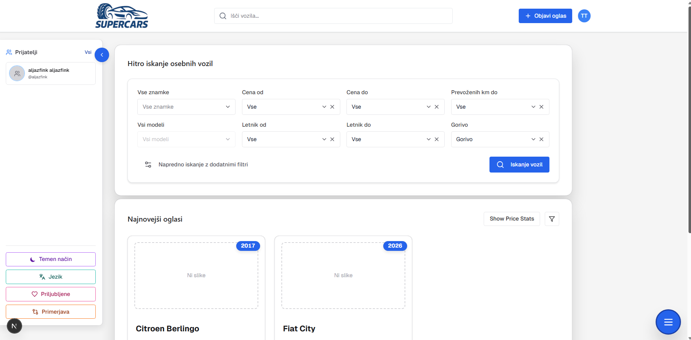

# superCars - Used Car Marketplace

A modern web application for buying and selling used cars, similar to avto.net and mobile.de. This platform provides a forum-style marketplace where users can browse, search, and list their vehicles for sale.

## 📸 Screenshots



*Quick search interface for personal vehicles with advanced filtering options*

## 🚗 Features

- **User Authentication & Profiles**: Secure user registration and login system
- **Car Listings**: Create, edit, and manage car listings with detailed information
- **Advanced Search & Filtering**: Search cars by make, model, price range, year, mileage, and more
- **Image Gallery**: Upload and manage multiple photos for each listing
- **Messaging System**: Direct communication between buyers and sellers
- **Favorites/Watchlist**: Save favorite listings for later viewing
- **Responsive Design**: Optimized for desktop, tablet, and mobile devices

## 🛠️ Tech Stack

### Backend
- **C#** - Primary programming language
- **ASP.NET Web API** - RESTful API framework
- **Entity Framework Core** - ORM for database operations
- **SQL Server** - Database management system

### Frontend
- **Next.js** - React framework for server-side rendering and static site generation
- **TypeScript** - Type-safe JavaScript
- **React** - UI library
- **Tailwind CSS** (recommended) - Utility-first CSS framework

## 📁 Project Structure

```
Vaja_RPO/
├── Backend/                     # ASP.NET Web API backend
│   ├── Controllers/             # API controllers (Auth, Car, User, CarApi)
│   ├── Models/                  # Domain models (User, Car, CarImage, etc.)
│   ├── DTOs/                    # Data Transfer Objects
│   │   ├── Auth/               # Authentication DTOs
│   │   ├── Car/                # Car-related DTOs
│   │   ├── CarApi/             # External API DTOs
│   │   └── User/               # User-related DTOs
│   ├── Services/                # Business logic services
│   ├── Migrations/              # Entity Framework migrations
│   ├── Options/                 # Configuration options
│   ├── wwwroot/                 # Static files and uploads
│   │   └── uploads/
│   │       └── avatars/         # User avatar images
│   ├── ApplicationDbContext.cs  # Database context
│   ├── Program.cs               # Application entry point
│   ├── appsettings.json         # Configuration file
│   ├── swagger.json             # OpenAPI specification
│   └── Backend.csproj          # Project file
├── frontend/                    # Next.js frontend
│   ├── src/
│   │   ├── app/                # Next.js app directory (pages)
│   │   │   ├── page.tsx        # Home page
│   │   │   ├── login/          # Login page
│   │   │   ├── register/       # Registration page
│   │   │   ├── create/         # Create car listing page
│   │   │   └── profile/        # User profile page
│   │   ├── components/         # React components
│   │   │   ├── auth/          # Authentication components
│   │   │   ├── car/           # Car-related components
│   │   │   ├── layout/        # Layout components
│   │   │   ├── profile/       # Profile components
│   │   │   └── ui/            # UI components
│   │   ├── lib/               # Utilities and helpers
│   │   │   ├── hooks/         # Custom React hooks
│   │   │   ├── types/         # TypeScript type definitions
│   │   │   └── utils/         # Utility functions
│   │   └── client/            # API client (generated)
│   ├── public/                 # Static assets (logos, images)
│   ├── package.json           # Node.js dependencies
│   └── README.md              # Frontend README
├── docs/                       # Documentation
│   └── Sprint3.md             # Sprint documentation
├── docker-compose.yml          # Docker Compose configuration
├── DATABASE_SETUP.md          # Database setup instructions
└── README.md                   # Main project README
```

## 🚀 Getting Started

### Prerequisites

- **.NET SDK** (8.0 or later)
- **Node.js** (18.0 or later)
- **npm** or **yarn**
- **Docker Desktop** (for SQL Server database)
- **Git** (for cloning the repository)

### Quick Start

1. **Clone the repository**:
   ```bash
   git clone <repository-url>
   cd Vaja_RPO
   ```

2. **Start the database** (using Docker Compose):
   ```bash
   docker-compose up -d
   ```
   Wait 10-30 seconds for SQL Server to be ready. See [DATABASE_SETUP.md](DATABASE_SETUP.md) for detailed database setup instructions.

3. **Set up the backend**:
   ```bash
   cd Backend
   dotnet restore
   dotnet ef database update
   dotnet run
   ```
   The API will be available at `http://localhost:5121` (Swagger UI: `http://localhost:5121/swagger`)

4. **Set up the frontend** (in a new terminal):
   ```bash
   cd frontend
   npm install
   # Create .env.local file
   echo "NEXT_PUBLIC_API_URL=http://localhost:5121" > .env.local
   npm run dev
   ```
   The application will be available at `http://localhost:3000`

### Detailed Setup Instructions

#### Database Setup

The project uses **SQL Server** running in a Docker container. The easiest way to get started is using Docker Compose:

```bash
# Start SQL Server container
docker-compose up -d

# Verify it's running
docker ps
```

The database connection is pre-configured in `Backend/appsettings.json`:
- **Server**: `localhost,1433`
- **Database**: `vajaRPO` (created automatically)
- **Username**: `sa`
- **Password**: `VajaRPO2025!`

For detailed database setup, troubleshooting, and alternative configurations, see [DATABASE_SETUP.md](DATABASE_SETUP.md).

#### Backend Setup

1. **Navigate to the Backend directory**:
   ```bash
   cd Backend
   ```

2. **Restore NuGet packages**:
   ```bash
   dotnet restore
   ```

3. **Configure the database connection** (if needed):
   
   The connection string in `appsettings.json` is already configured for Docker Compose setup. If you're using a different SQL Server instance, update:
   ```json
   {
     "ConnectionStrings": {
       "DefaultConnection": "Server=localhost,1433;Database=vajaRPO;User=sa;Password=VajaRPO2025!;TrustServerCertificate=True;"
     }
   }
   ```

4. **Run database migrations**:
   ```bash
   dotnet ef database update
   ```
   This creates the database schema and applies all migrations.

5. **Start the API server**:
   ```bash
   dotnet run
   ```
   
   The API will be available at:
   - **HTTP**: `http://localhost:5121`
   - **HTTPS**: `https://localhost:7091`
   - **Swagger UI**: `http://localhost:5121/swagger`

#### Frontend Setup

1. **Navigate to the frontend directory**:
   ```bash
   cd frontend
   ```

2. **Install dependencies**:
   ```bash
   npm install
   # or
   yarn install
   ```

3. **Configure the API endpoint**:
   
   Create a `.env.local` file in the `frontend` directory:
   ```env
   NEXT_PUBLIC_API_URL=http://localhost:5121
   ```
   
   This tells the frontend where to find the backend API.

4. **Start the development server**:
   ```bash
   npm run dev
   # or
   yarn dev
   ```

   The application will be available at `http://localhost:3000`

### Running Both Services

To run both backend and frontend simultaneously:

**Terminal 1** (Backend):
```bash
cd Backend
dotnet run
```

**Terminal 2** (Frontend):
```bash
cd frontend
npm run dev
```

**Terminal 3** (Database - if not already running):
```bash
docker-compose up -d
```

### Verifying the Setup

1. **Database**: Check Docker container status
   ```bash
   docker ps
   ```
   Should show `vaja-rpo-sqlserver` container running.

2. **Backend**: Visit `http://localhost:5121/swagger` - you should see the Swagger API documentation.

3. **Frontend**: Visit `http://localhost:3000` - you should see the application homepage.

### Troubleshooting

- **Database connection issues**: See [DATABASE_SETUP.md](DATABASE_SETUP.md) for troubleshooting steps.
- **Port conflicts**: If port 5121 or 3000 is in use, update the ports in `Backend/Properties/launchSettings.json` and `frontend/package.json` respectively.
- **Migration errors**: Ensure SQL Server is running and the connection string is correct before running migrations.

## 📝 API Endpoints

All endpoints are served from the backend API base URL (for local development this is typically `http://localhost:5121`).

### 🔐 Authentication (`/api/auth`)

- **POST** `/api/auth/register`  
  - **Body**: `RegisterRequest` (name, surname, email, phoneNumber, username, password)
  - **Description**: Register a new user account.

- **POST** `/api/auth/login`  
  - **Body**: `LoginRequest` (username, password)  
  - **Description**: Authenticate user and return tokens.

- **POST** `/api/auth/logout`  
  - **Description**: Logout the current user and invalidate refresh token.

- **POST** `/api/auth/refresh`  
  - **Body**: `RefreshRequest` (refreshToken)  
  - **Description**: Get a new access token using a valid refresh token.

### 🚘 Cars (`/api/cars`)

- **POST** `/api/cars`  
  - **Body**: `CreateCarRequest` (makeId, modelId, year, mileage, price, fuelType, etc.)  
  - **Description**: Create a new car listing.

- **GET** `/api/cars`  
  - **Query params** (optional):  
    - `page` (default: 1), `pageSize` (default: 20)  
    - `makeId`, `modelId`  
    - `yearFrom`, `yearTo`  
    - `priceFrom`, `priceTo`  
    - `mileageTo`  
    - `fuelType`  
  - **Description**: Get a paginated list of cars with optional filters.

- **GET** `/api/cars/{id}`  
  - **Path params**: `id` (int)  
  - **Description**: Get details of a specific car.

- **POST** `/api/cars/{id}/images`  
  - **Path params**: `id` (int)  
  - **Body**: `multipart/form-data` with `files` (array of image files)  
  - **Description**: Upload one or more images for a car.

- **PUT** `/api/cars/{id}/images/{imageId}/set-main`  
  - **Path params**: `id` (int), `imageId` (int)  
  - **Description**: Mark a specific image as the main image for a car.

### 📚 Car Catalog (`/api/car-catalog`)

- **GET** `/api/car-catalog/makes`  
  - **Description**: Get all car makes.

- **GET** `/api/car-catalog/makes/search`  
  - **Query params**: `query` (string)  
  - **Description**: Search car makes by name.

- **GET** `/api/car-catalog/makes/{makeId}/models`  
  - **Path params**: `makeId` (string)  
  - **Description**: Get models for a specific make.

### 👤 User (`/api/user`)

- **GET** `/api/user/me`  
  - **Description**: Get the profile of the currently authenticated user.

- **PUT** `/api/user/password`  
  - **Body**: `ChangePasswordRequest` (currentPassword, newPassword)  
  - **Description**: Change the current user's password.

- **PUT** `/api/user/profile`  
  - **Body**: `UpdateProfileRequest` (optional name, surname, phoneNumber)  
  - **Description**: Update the current user's profile details.

- **PUT** `/api/user/avatar`  
  - **Body**: `multipart/form-data` with `file` (image)  
  - **Description**: Update the current user's avatar image.

## 🧪 Testing

### Backend Tests
```bash
cd Backend
dotnet test
```

### Frontend Tests
```bash
cd frontend
npm test
```

## 🤝 Contributing

1. Fork the repository
2. Create your feature branch (`git checkout -b feature/AmazingFeature`)
3. Commit your changes (`git commit -m 'Add some AmazingFeature'`)
4. Push to the branch (`git push origin feature/AmazingFeature`)
5. Open a Pull Request

## 📄 License

This project is licensed under the MIT License - see the LICENSE file for details.

## 💬 Support

If you encounter issues, have suggestions, or need help with setup, feel free to reach out:

- **Email 1**: [aljaz.ski@gmail.com](mailto:aljaz.ski@gmail.com)
- **Email 2**: [Smajilovicernes@gmail.com](mailto:Smajilovicernes@gmail.com)
- **Email 3**: [enejev.lokar07@gmail.com](mailto:enejev.lokar07@gmail.com)

We aim to respond as soon as possible and appreciate clear descriptions, screenshots, or logs when reporting problems.


## 🙏 Acknowledgments

- Inspired by avto.net and mobile.de
- Built with modern web technologies for optimal performance and user experience